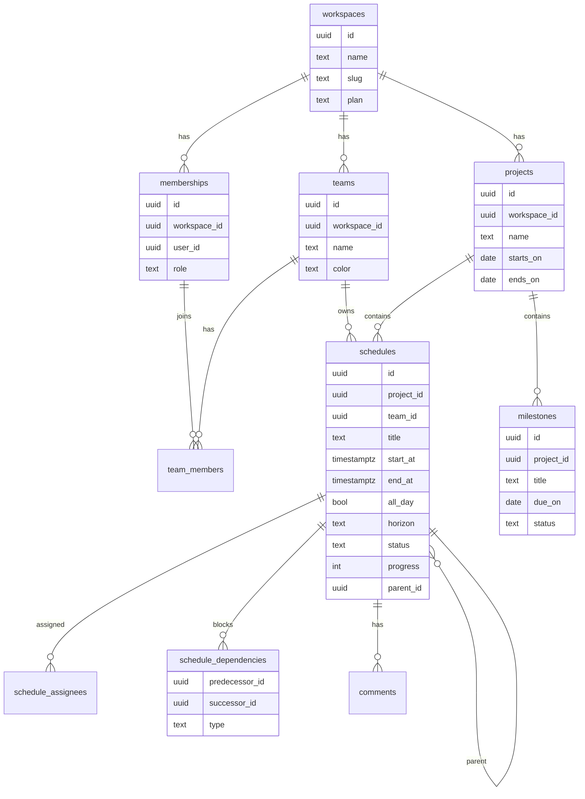

# TeamSync — 데이터 모델 및 백엔드 설계

- Feature: `team-scheduler`
- 대상: Supabase (Postgres 15+, Auth, Realtime, RLS)

## 1. 앱 배치 결정

기존 저장소는 Vite + React SPA(`src/pages/Map` 등 모니터링 UI)이며 이 기능과 도메인이 겹치지 않는다.
→ **모노레포로 분리**한다.

```
apps/
  alpetax/          # 기존 Vite SPA (그대로 이동)
  scheduler/        # 신규 Next.js App Router 앱
packages/
  schedule-core/    # 날짜/구간 계산, horizon 추론, 레이아웃 알고리즘 (프레임워크 무관, 순수 TS)
  ui/               # 공용 디자인 토큰 + 프리미티브
supabase/
  migrations/       # SQL 마이그레이션
  seed.sql
```

`packages/schedule-core`를 순수 TS로 빼는 이유: 간트 레이아웃과 겹침 해소 로직은 뷰와 무관하게 단위 테스트가 가능해야 한다.

## 2. ERD



## 3. 스키마 (마이그레이션)

`supabase/migrations/0001_init.sql`

```sql
create extension if not exists "pgcrypto";
create extension if not exists btree_gist;

-- ── 테넌시 ───────────────────────────────────────────────
create table workspaces (
  id          uuid primary key default gen_random_uuid(),
  name        text not null,
  slug        text not null unique,
  plan        text not null default 'free' check (plan in ('free','pro','business')),
  created_at  timestamptz not null default now()
);

create type member_role as enum ('owner','admin','member','guest');

create table memberships (
  id            uuid primary key default gen_random_uuid(),
  workspace_id  uuid not null references workspaces on delete cascade,
  user_id       uuid not null references auth.users on delete cascade,
  role          member_role not null default 'member',
  display_name  text,
  avatar_url    text,
  created_at    timestamptz not null default now(),
  unique (workspace_id, user_id)
);

create table teams (
  id            uuid primary key default gen_random_uuid(),
  workspace_id  uuid not null references workspaces on delete cascade,
  name          text not null,
  -- 캘린더/간트에서 일정 색을 결정하는 단일 출처
  color         text not null default '#5B8DEF',
  created_at    timestamptz not null default now(),
  unique (workspace_id, name)
);

create table team_members (
  team_id       uuid not null references teams on delete cascade,
  membership_id uuid not null references memberships on delete cascade,
  primary key (team_id, membership_id)
);

-- ── 일정 도메인 ──────────────────────────────────────────
create table projects (
  id            uuid primary key default gen_random_uuid(),
  workspace_id  uuid not null references workspaces on delete cascade,
  name          text not null,
  description   text,
  starts_on     date,
  ends_on       date,
  archived_at   timestamptz,
  created_at    timestamptz not null default now()
);

create type horizon      as enum ('long','mid','short');
create type sched_status as enum ('planned','active','blocked','done','cancelled');

create table schedules (
  id           uuid primary key default gen_random_uuid(),
  workspace_id uuid not null references workspaces on delete cascade,
  project_id   uuid references projects on delete set null,
  team_id      uuid references teams on delete set null,
  parent_id    uuid references schedules on delete cascade,
  title        text not null,
  description  text,
  start_at     timestamptz not null,
  end_at       timestamptz not null,
  all_day      boolean not null default true,
  horizon      horizon not null default 'short',
  status       sched_status not null default 'planned',
  progress     smallint not null default 0 check (progress between 0 and 100),
  -- 간트 행 정렬용 수동 순서 (같은 부모 내에서만 유효)
  sort_order   double precision not null default 0,
  created_by   uuid not null references auth.users,
  created_at   timestamptz not null default now(),
  updated_at   timestamptz not null default now(),
  constraint schedules_range_valid check (end_at >= start_at)
);

-- 범위 질의(월/주/일 뷰)는 전부 "이 구간과 겹치는 일정"이다 → GiST 범위 인덱스
create index schedules_span_idx on schedules
  using gist (workspace_id, tstzrange(start_at, end_at, '[]'));
create index schedules_project_idx on schedules (project_id, start_at);
create index schedules_team_idx    on schedules (team_id, start_at);

create table schedule_assignees (
  schedule_id   uuid not null references schedules on delete cascade,
  membership_id uuid not null references memberships on delete cascade,
  primary key (schedule_id, membership_id)
);

```

```sql
create type dep_type as enum ('finish_to_start','start_to_start','finish_to_finish');

create table schedule_dependencies (
  predecessor_id uuid not null references schedules on delete cascade,
  successor_id   uuid not null references schedules on delete cascade,
  type           dep_type not null default 'finish_to_start',
  primary key (predecessor_id, successor_id),
  constraint no_self_dep check (predecessor_id <> successor_id)
);

create type milestone_status as enum ('upcoming','reached','missed');

create table milestones (
  id           uuid primary key default gen_random_uuid(),
  workspace_id uuid not null references workspaces on delete cascade,
  project_id   uuid not null references projects on delete cascade,
  title        text not null,
  description  text,
  due_on       date not null,
  status       milestone_status not null default 'upcoming',
  created_at   timestamptz not null default now()
);
create index milestones_due_idx on milestones (workspace_id, due_on);

create table comments (
  id           uuid primary key default gen_random_uuid(),
  workspace_id uuid not null references workspaces on delete cascade,
  schedule_id  uuid not null references schedules on delete cascade,
  author_id    uuid not null references auth.users,
  body         text not null,
  created_at   timestamptz not null default now()
);
```

### horizon 자동 추론

기간 길이로 기본값을 채우되, 사용자가 명시하면 유지한다. 트리거가 아니라 **애플리케이션 계층**(`packages/schedule-core/horizon.ts`)에서 계산하고, 사용자가 손댔는지는 `horizon_locked boolean default false`로 구분한다.

```ts
export function inferHorizon(startAt: Date, endAt: Date): Horizon {
  const days = differenceInCalendarDays(endAt, startAt) + 1;
  if (days >= 90) return 'long';   // 분기 이상
  if (days >= 14) return 'mid';    // 2주 이상
  return 'short';
}
```

## 4. RLS 정책

모든 테이블에 `workspace_id`를 두고, **단 하나의 판별 함수**로 접근을 통일한다. 테이블마다 조인을 반복하지 않는 것이 핵심이다.

```sql
-- 현재 사용자가 속한 워크스페이스 집합 (STABLE → 쿼리당 1회 평가)
create or replace function auth_workspace_ids()
returns setof uuid language sql stable security definer set search_path = public as $$
  select workspace_id from memberships where user_id = auth.uid()
$$;

create or replace function auth_role(ws uuid)
returns member_role language sql stable security definer set search_path = public as $$
  select role from memberships where user_id = auth.uid() and workspace_id = ws
$$;

alter table workspaces enable row level security;
alter table memberships enable row level security;
alter table teams enable row level security;
alter table team_members enable row level security;
alter table projects enable row level security;
alter table schedules enable row level security;
alter table milestones enable row level security;
alter table comments enable row level security;
alter table schedule_assignees enable row level security;
alter table schedule_dependencies enable row level security;

-- 읽기: 같은 워크스페이스면 전부 보인다 (팀 일정 공유가 제품의 목적)
create policy read_ws on schedules for select
  using (workspace_id in (select auth_workspace_ids()));

-- 쓰기: guest 제외
create policy write_ws on schedules for insert
  with check (workspace_id in (select auth_workspace_ids())
              and auth_role(workspace_id) <> 'guest');

create policy update_ws on schedules for update
  using (workspace_id in (select auth_workspace_ids())
         and auth_role(workspace_id) <> 'guest');

create policy delete_ws on schedules for delete
  using (auth_role(workspace_id) in ('owner','admin')
         or created_by = auth.uid());
```

`teams` / `projects` / `milestones` / `comments`도 동일한 4정책 형태를 반복한다 (`comments`의 delete는 `author_id = auth.uid()` 추가).
`team_members` · `schedule_assignees` · `schedule_dependencies`는 부모 행의 `workspace_id`를 `exists` 서브쿼리로 확인한다.

**Guest 처리**: guest는 `read_ws`로 워크스페이스 전체를 보게 되므로 부족하다. guest에게는 `project_guests(project_id, membership_id)` 테이블을 두고, 읽기 정책을 두 갈래로 나눈다.

```sql
create policy read_ws on schedules for select using (
  workspace_id in (select auth_workspace_ids())
  and (
    auth_role(workspace_id) <> 'guest'
    or project_id in (select project_id from project_guests pg
                      join memberships m on m.id = pg.membership_id
                      where m.user_id = auth.uid())
  )
);
```

## 5. 조회 API

Next.js Server Component에서 Supabase 클라이언트로 직접 조회하고, 변경은 Server Action으로 처리한다. 별도 REST 계층을 만들지 않는다.

### 범위 조회 (월/주/일 공통)

세 뷰의 질의는 모두 동일하다 — "구간 `[from, to]`와 겹치는 일정". 뷰마다 다른 쿼리를 만들지 않는 것이 이 설계의 요점이다.

```sql
create or replace function schedules_in_range(
  ws uuid, from_ts timestamptz, to_ts timestamptz,
  team_ids uuid[] default null, assignee_ids uuid[] default null
) returns setof schedules language sql stable as $$
  select s.* from schedules s
  where s.workspace_id = ws
    and tstzrange(s.start_at, s.end_at, '[]') && tstzrange(from_ts, to_ts, '[]')
    and (team_ids is null or s.team_id = any(team_ids))
    and (assignee_ids is null or exists (
          select 1 from schedule_assignees a
          where a.schedule_id = s.id and a.membership_id = any(assignee_ids)))
  order by s.start_at, s.sort_order
$$;
```

호출:

```ts
const { data } = await supabase.rpc('schedules_in_range', {
  ws: workspaceId,
  from_ts: range.start.toISOString(),
  to_ts: range.end.toISOString(),
  team_ids: filters.teamIds ?? null,
  assignee_ids: filters.assigneeIds ?? null,
});
```

### Server Actions

| Action | 서명 | 비고 |
|---|---|---|
| `createSchedule` | `(input: ScheduleDraft) => Schedule` | 필수: `title`, `startAt`, `endAt`. horizon 미지정 시 `inferHorizon` |
| `updateSchedule` | `(id, patch, expectedUpdatedAt) => Schedule` | 낙관적 락 — `updated_at` 불일치 시 `409 CONFLICT` |
| `moveSchedule` | `(id, deltaMinutes)` | 드래그 이동. 의존 일정 연쇄 이동은 P2 |
| `resizeSchedule` | `(id, edge, newAt)` | 바 끝 리사이즈 |
| `deleteSchedule` | `(id)` | |
| `upsertMilestone` | `(input)` | |
| `addComment` | `(scheduleId, body)` | |

### 낙관적 락

```ts
const { data, error } = await supabase
  .from('schedules')
  .update({ ...patch, updated_at: new Date().toISOString() })
  .eq('id', id)
  .eq('updated_at', expectedUpdatedAt)   // 그 사이 남이 고쳤으면 0행
  .select().single();

if (!data) throw new ConflictError('다른 멤버가 방금 이 일정을 수정했습니다.');
```

## 6. Realtime

```ts
supabase.channel(`ws:${workspaceId}`)
  .on('postgres_changes',
      { event: '*', schema: 'public', table: 'schedules',
        filter: `workspace_id=eq.${workspaceId}` },
      (payload) => cache.apply(payload))
  .subscribe();
```

수신한 변경은 현재 보고 있는 범위와 겹칠 때만 스토어에 반영한다. 범위 밖 변경은 버려서 리렌더를 막는다.

## 7. 성능 목표 대응

| 위험 | 대응 |
|---|---|
| 일정 수천 건 간트 렌더 | 행 단위 가상 스크롤 + 화면 밖 바는 DOM 미생성 |
| 월 뷰 재계산 | 레이아웃(겹침 해소)은 `schedule-core`의 순수 함수 → 입력 동일하면 메모이즈 |
| 드래그 중 왕복 | 낙관적 업데이트 후 실패 시 롤백 |
| RLS 함수 호출 폭증 | `auth_workspace_ids()`를 `stable`로 선언하고 `in (select …)` 형태로만 사용 |
